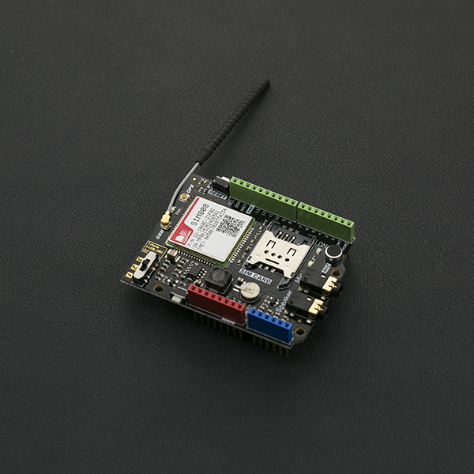

# DFRobot_SIM808
* [English Version](./README.md)

SIM808 GPS/GPRS/GSM 是一款集成了四频段GSM/GPRS和GPS导航技术的Arduino扩展板。尺寸仅与一块信用卡相当，符合标准Arduino管脚分装，兼容Arduino UNO、 Leonardo、Mega等主控器。 SIM808相比上一代的SIM908在性能和稳定性上做了一定提升，除了正常的短信和电话功能外，还支持彩信、DTMF、FTP等功能。可以实现数据采集，无线数据收发等物联网应用。板载麦克风和耳机接口，节约了用户的使用成本，更加简单和方便，还可以通过外接天线接口直连GSM和GPS天线。 SIM808 GPS/GPRS/GSM Shield V1.0采用Simcom最新版SIM808模块，与市面上现有的SIM808模块相比，新版的模块具有更好的稳定性。




## 产品链接 (https://www.dfrobot.com.cn/goods-1278.html)
    SKU: TEL0097


## 目录

* [概述](#概述)
* [库安装](#库安装)
* [方法](#方法)
* [兼容性](#兼容性)
* [历史](#历史)
* [创作者](#创作者)


## 概述

* 发送和接收GPRS数据(TCP/IP, HTTP等)
* 接收GPS数据和A-GPS数据
* 发送和接收短信
* 打电话和接电话


## 库安装

要使用这个库, 首先下载库文件, 将其粘贴到\Arduino\libraries目录中, 然后打开示例文件夹并在文件夹中运行演示。


## 方法

```C++

    /**
     * @fn DFRobot_SIM808
     * @brief Constructor
     * @param mySerial  serial ports for communication, supporting hard and soft serial ports
     * @n Tx, rx, and baudRate can also be passed in this order
     * @return None
     */
    DFRobot_SIM808(SoftwareSerial *mySerial);
    DFRobot_SIM808(HardwareSerial *mySerial);
    DFRobot_SIM808(uint8_t tx, uint8_t rx, uint32_t baudRate = 9600);

    /**
     * @fn getInstance
     * @brief get instance of DFRobot_SIM808 class
     * @return instance of DFRobot_SIM808 class
     */
    static DFRobot_SIM808* getInstance() { return inst; };

    /**
     * @fn init
     * @brief initialize DFRobot_SIM808 module including SIM card check & signal strength
     * @return true if connected, false otherwise
     */
    bool init(void);

    /**
     * @fn checkPowerUp
     * @brief check if DFRobot_SIM808 module is powered on or not
     * @return true on success, false on error
     */
    bool checkPowerUp(void);

    /**
     * @fn powerUpDown
     * @brief power Up DFRobot_SIM808 module (JP has to be soldered)
     * @param pin  pin 9 connected to JP jumper so we can power up and down through software
     * @return None
     */
    void powerUpDown(uint8_t pin);

    /**
     * @fn powerReset
     * @brief power reset for SIM800 board
     * @param pin  (preconfigurated as OUTPUT)
     * @return None
     */
    void powerReset(uint8_t pin);

    /**
     * @fn sendSMS
     * @brief send text SMS
     * @param number  phone number which SMS will be send to
     * @param data  message that will be send to
     * @return true on success, false on error
     */
    bool sendSMS(char* number, char* data);

    /**
     * @fn isSMSunread
     * @brief Check if there is any UNREAD SMS: this function DOESN'T change the UNREAD status of the SMS
     * @return returned value
     * @retval 1~20 - on success, position/index where SMS is stored, suitable for the function ReadSMS
     * @retval -1 - on error
     * @retval 0 - there is no SMS with specified status (UNREAD)
     */
    char isSMSunread(void);

    /**
     * @fn readSMS
     * @brief read SMS, phone and date if getting a SMS message. It changes SMS status to READ
     * @param messageIndex  SIM position to read
     * @param message  buffer used to get SMS message
     * @param length  length of message buffer
     * @param phone  buffer used to get SMS's sender phone number
     * @param datetime  buffer used to get SMS's send datetime
     * @return true on success, false on error
     */
    bool readSMS(int messageIndex, char *message, int length, char *phone, char *datetime); 

    /**
     * @fn readSMS
     * @brief read SMS if getting a SMS message
     * @param buffer  buffer that get from DFRobot_SIM808 module(when getting a SMS, DFRobot_SIM808 module will return a buffer array)
     * @param message  buffer used to get SMS message
     * @param check  whether to check phone number(we may only want to read SMS from specified phone number)
     * @return true on success, false on error
     */
    bool readSMS(int messageIndex, char *message, int length);

    /**
     * @fn deleteSMS
     * @brief delete SMS message on SIM card
     * @param index  the index number which SMS message will be delete
     * @return true on success, false on error
     */
    bool deleteSMS(int index);

    /**
     * @fn callUp
     * @brief call someone
     * @param number  the phone number which you want to call
     * @return true on success, false on error
     */
    bool callUp(char* number);

    /**
     * @fn answer
     * @brief auto answer if coming a call
     * @return None
     */
    void answer(void);

    /**
     * @fn hangup
     * @brief hang up if coming a call
     * @return true on success, false on error
     */
    bool hangup(void);

    /**
     * @fn disableCLIPring
     * @brief Disable +CLIP notification when an incoming call is active, RING text is always shown. See isCallActive function
     * @note This is done in order no to overload serial outputCheck if there is a call active and get the phone number in that case
     * @return true on success, false on error
     */
    bool disableCLIPring(void);

    /**
     * @fn getSubscriberNumber
     * @brief Get Subscriber Number (your number) using AT+CNUM command, but if nothing return, then
     * @n     you need to command this to your SIM900. (See AT+CPBS, AT+CPBW)
     * @n     AT+CPBS="ON"
     * @n     AT+CPBW=1,"+{Your Number}",145
     * @n     AT+CPBS="SM"
     * @param number  your phone number
     * @return true on success, false on error
     */
    bool getSubscriberNumber(char *number);

    /**
     * @fn isCallActive
     * @brief Check if there is a call active and get the phone number in that case
     * @param number  Check if there is a call active and get the phone number in that case
     * @return true on success, false on error
     */
    bool isCallActive(char *number);

    /**
     * @fn getDateTime
     * @brief get DateTime from SIM900 (see AT command: AT+CLTS=1) as string
     * @param buffer  DateTime from SIM900
     * @return true on success, false on error
     * @note If it doesn't work may be for two reasons:
     * @n    1. Your carrier doesn't give that information
     * @n    2. You have to configurate the SIM900 IC.
     * @n    - First with SIM900_Serial_Debug example try this AT command: AT+CLTS?
     * @n    - If response is 0, then it is disabled.
     * @n    - Enable it by: AT+CLTS=1
     * @n    - Now you have to save this config to EEPROM memory of SIM900 IC by: AT&W
     * @n    - Now, you have to power down and power up again the SIM900 
     * @n    - Try now again: AT+CCLK?
     * @n    - It should work now
     * 
     */
    bool getDateTime(char *buffer);

    /**
     * @fn getSignalStrength
     * @brief get Signal Strength from SIM900 (see AT command: AT+CSQ) as integer
     * @param buffer  Signal Strength
     * @return true on success, false on error
     */
    bool getSignalStrength(int *buffer);

    /**
     * @fn sendUSSDSynchronous
     * @brief Send USSD Command Synchronously (Blocking call until unsolicited response is received)
     * @param ussdCommand  command UUSD, ex: *123#
     * @param resultCode  char Result Code, see AT+CUSD command
     * @param response  string response
     * @return true on success, false on error
     */  
    bool sendUSSDSynchronous(char *ussdCommand, char *resultcode, char *response);

    /**
     * @fn cancelUSSDSession
     * @brief Cancel USSD Session
     * @return true on success cancel active session, false on error or because no active session
     */
    bool cancelUSSDSession(void);

/*************************** DFRobot_SIM808 ***************************/

    /**
     * @fn join
     * @brief Connect the DFRobot_SIM808 module to the network.
     * @param apn  APN(Access Point Name)
     * @param userName  user name
     * @param passWord  pass word
     * @return true if connected, false otherwise
     */
    bool join(const __FlashStringHelper *apn = 0, const __FlashStringHelper *userName = 0, const __FlashStringHelper *passWord = 0);

    /**
     * @fn disconnect
     * @brief Disconnect the DFRobot_SIM808 module from the network
     * @return None
     */
    void disconnect(void);

    /**
     * @fn connect
     * @brief Open a tcp/udp connection with the specified host on the specified port
     * @param ptl protocol for socket, TCP/UDP can be choosen
     * @param host host (can be either an ip address or a name. If a name is provided, a dns request will be established)
     * @param port port
     * @param timeout wait seconds till connected
     * @param chartimeout wait milliseconds between characters from DFRobot_SIM808 module
     * @return true if successful, false if error
     */
    bool connect(Protocol ptl, const char * host, int port, int timeout = 2 * DEFAULT_TIMEOUT, int chartimeout = 2 * DEFAULT_INTERCHAR_TIMEOUT);
    bool connect(Protocol ptl, const __FlashStringHelper *host, const __FlashStringHelper *port, int timeout = 2 * DEFAULT_TIMEOUT, int chartimeout = 2 * DEFAULT_INTERCHAR_TIMEOUT);

    /**
     * @fn is_connected
     * @brief Check if a tcp link is active
     * @return true if successful, false if error
     */
    bool is_connected(void);

    /**
     * @fn close
     * @brief Close a tcp connection
     * @return true if successful, false if error
     */
    bool close(void);

    /**
     * @fn readable
     * @brief check if DFRobot_SIM808 module is readable or not
     * @return true if readable
     */
    int readable(void);

    /**
     * @fn wait_readable
     * @brief wait a few time to check if DFRobot_SIM808 module is readable or not
     * @param wait_time time of waiting
     * @return Returns the length of readable data
     */
    int wait_readable(int wait_time);

    /**
     * @fn wait_writeable
     * @brief wait a few time to check if DFRobot_SIM808 module is writeable or not
     * @param req_size time of waiting
     * @return req_size + 1
     */
    int wait_writeable(int req_size);

    /**
     * @fn send
     * @brief send data to socket
     * @param str string to be sent
     * @param len string length
     * @return return bytes that actually been send
     */
    int send(const char * str, int len);

    /**
     * @fn recv
     * @brief read data from socket
     * @param buf buffer that will store the data read from socket
     * @param len string length need to read from socket
     * @return bytes that actually read
     */
    int recv(char* buf, int len);

    /**
     * @fn listen
     * @brief Enables the selected software serial port to listen
     * @return None
     */
    void listen(void);

    /**
     * @fn isListening
     * @brief Tests to see if requested software serial port is actively listening.
     * @return Now masking enabled, return null
     */
    bool isListening(void);

    /**
     * @fn gethostbyname
     * @brief convert the host to ip
     * @param host host ip string, ex. 10.11.12.13
     * @param ip long int ip address, ex. 0x11223344
     * @return true if successful
     */
    //NOT USED bool gethostbyname(const char* host, uint32_t* ip); 

    /**
     * @fn getIPAddress
     * @brief get IP address
     * @return IP address, char*
     */
    char* getIPAddress(void);

    /**
     * @fn getIPnumber
     * @brief get IP number
     * @return IP number, unsigned long
     */
    unsigned long getIPnumber(void);

    /**
     * @fn getLocation
     * @brief get Location
     * @param apn APN(Access Point Name)
     * @param longitude longitude
     * @param latitude latitude
     * @return true if successful, false if error
     */
    bool getLocation(const __FlashStringHelper *apn, float *longitude, float *latitude);

    /**
     * @fn attachGPS
     * @brief Open GPS
     * @return true if successful, false if error
     */
    bool attachGPS(void);

    /**
     * @fn detachGPS
     * @brief Close GPS
     * @return true if successful, false if error
     */
    bool detachGPS(void);

    /**
     * @fn getTime
     * @brief parse time
     * @param time Time data to be parsed
     * @return None
     */
    void getTime(uint32_t time);

    /**
     * @fn getDate
     * @brief parse date
     * @param date Date data to be parsed
     * @return None
     */
    void getDate(uint32_t date);

    /**
     * @fn parseDecimal
     * @brief Parse a (potentially negative) number with up to 2 decimal digits -xxxx.yy
     * @param term Data to be parsed
     * @return Parsed data
     */
    int32_t parseDecimal(const char *term);

    /**
     * @fn latitudeConverToDMS
     * @brief  latitude Conver To DMS
     * @return None
     */
    void latitudeConverToDMS(void);

    /**
     * @fn LongitudeConverToDMS
     * @brief Longitude Conver To DMS
     * @return None
     */
    void LongitudeConverToDMS(void);

    /**
     * @fn parseGPRMC
     * @brief parser GPRMC, Determine whether gpsbuffer[18] is 'A'
     * @param gpsbuffer GPS buffer data to be parsed
     * @return true if gpsbuffer[18] is 'A'
     */
    bool parseGPRMC(char *gpsbuffer);

    /**
     * @fn getGPRMC
     * @brief Get the parsed GPRMC
     * @return true if successful, false if error
     */
    bool getGPRMC(void);

    /**
     * @fn getGPS
     * @brief get GPS signal
     * @return true if successful, false if error
     */
    bool getGPS(void); 

```


## 兼容性

MCU                | Work Well    | Work Wrong   | Untested    | Remarks
------------------ | :----------: | :----------: | :---------: | :----:
Arduino Uno        |      √       |              |             |
Arduino MEGA2560   |      √       |              |             |
Arduino Leonardo   |      √       |              |             |


## 历史

- 2022/02/08 - 1.0.0 版本
- 2022/06/30 - 1.0.1 版本


## 创作者

Written by [Jason](jason.ling@dfrobot.com), 2022. (Welcome to our [website](https://www.dfrobot.com/))

